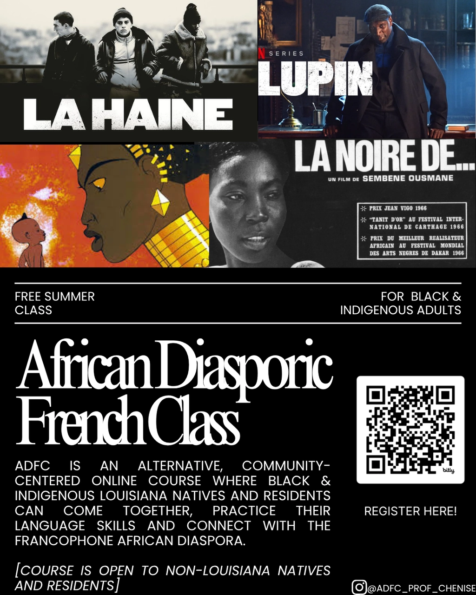
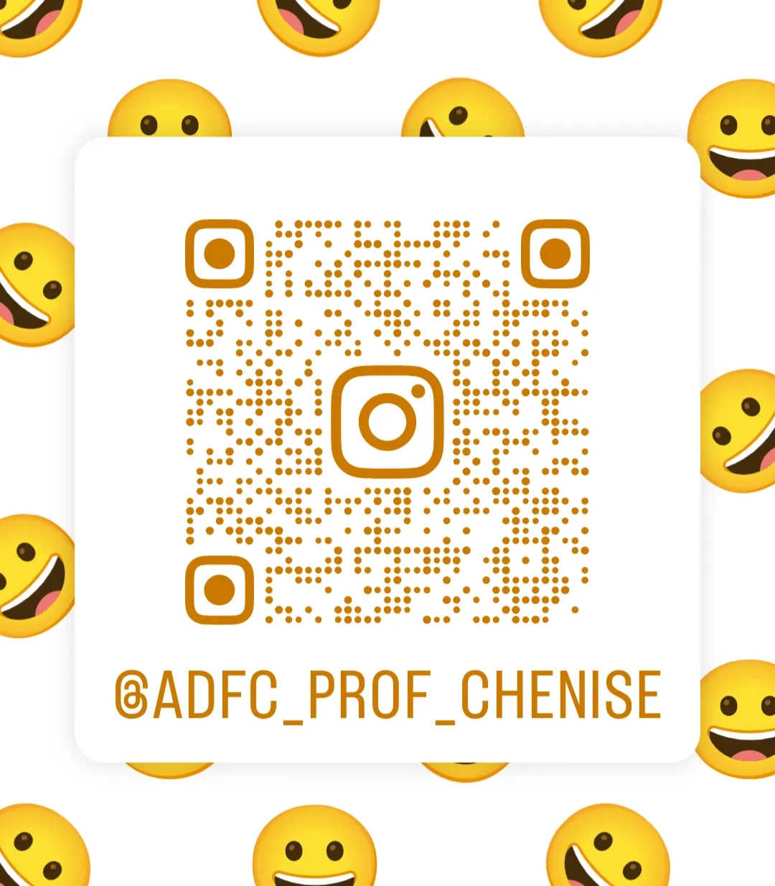

*Soyez les bienvenus 😉 🇲🇶 🇬🇵 🇭🇹 ⚜ 🇸🇳 🇫🇷 🇹🇬 🇧🇯 🇨🇮 🇲🇷 🇲🇱 🇬🇳 🇨🇩 🇨🇬🇨🇫🇨🇲🇰🇲🇹🇬🇹🇩🇧🇪🇸🇨🇳🇪*

# **We’re building a Free Education Empire😏**

~~ Welcome all new-comers👋🏿. This is a free online class, a safe space cultivated ***by*** and ***for*** African/ African-descendant populations and Indigenous populations 💖 You can find class recordings, class presentations, and syllabi under COURSES. 

~~FR: Bienvenue à tous les nouveaux arrivants 👋🏿. Ce cours en ligne est gratuit et se déroule dans un espace sûr, et est créé par et pour les populations africaines/afro-descendantes et indigènes 💖. Vous trouverez les enregistrements, les présentations et les programmes des cours dans la section **COURSES**.

 **REGISTER NOW FOR OUR SUMMER CLASS**: [Google Docs SU2026](https://forms.gle/u4cEuyNunry1wNtB7) | African Diasporic French Class Registration Form ✨

 

## Why sign up for ADFC??🤔

1. To travel! ✈ and (re)gain freedom of mobility in this big-- but small-- world. *Language and Cultural Awareness are the real passports!*
2. To strengthening neural pathways, enhance cognitive functions, and stretch your neuroplasticity to delay onset dementia
3. To be the family translator on trips to Quebec, Benin, Burkina Faso, Burundi, Cameroon, Central African Republic, Chad, Comoros, Democratic Republic of the Congo, Republic of the Congo, Djibouti, Equatorial Guinea, Gabon, Guinea, Haiti, Ivory Coast (Côte d'Ivoire), Madagascar, Mali, Mauritius, Martinique, Niger, Rwanda, Senegal, Seychelles, Togo, France, Belgium, Switzerland
4. To teach your kids, family or community
5. To speak to French-speaking patients or clients at your job
6. To get a raise because you possess a skill your peers don't have
7. To Access to more educational, professional and travel opportunities
8. To be a steward of history; to have more Black and Indigenous eyes👀 on  French-language archives- ie. Colonial Louisiana manuscripts that hold the stories of African and African-descended people (examples: https://docs.k4bl.org/)
9. To be in real conversation with our people across the diaspora 🗣
10. 10. To potentially live abroad and/or get dual-citizenship in a French-speaking country 🌍 (Like Ciara, Lauryn Hill, Spike Lee, Nina Simone, James Baldwin, Rita Marley, Maya Angelous, WED Dubois etc.)
11. To prove that you can do hard things, when given the resources and right support system 🫶🏿
12. To become aware (or expand your awareness) of notable people, moments and empires in pre-colonial African and diasporic history as it relates to Louisiana, as well as to combat colonial and anti-Black rhetoric which normalizes ignorance of our diverse histories
13. To take your existing skills and hobbies on an international scale! (be it fashion, cooking🍲, sports🏀, skating🛼, music, pottery, & painting, photography, meditation & yoga, reading, cycling and running, etc.)
14. To grow as a person🌱; To see yourself outside the bounds of National Identity; or even outside the bounds of the English language (our inherited language)
15. AND MORE!!✨

Follow us on IG for language and diasporic content📸:  

[https://www.instagram.com/adfc_prof_chenise?igsh=MXEyYTR5cDV4c2JtMg%3D%3D](adfc_prof_chenise African Diasporic French Class (@adfc_prof_chenise))

## For personalized French lessons with the prof (Chenise)

[Preply Chenise C., A fun university teacher who's dedicated to help… ](https://preply.in/CHENISE9EN3677784311?ts=17783654) $25/50min.

[Superprof Chenise - French tutor in New Orleans - 27$/h](https://www.superprof.com/french-studies-phd-who-teaches-french-the-university-level-creating-fun-and-motivating-learning-environment.html)
